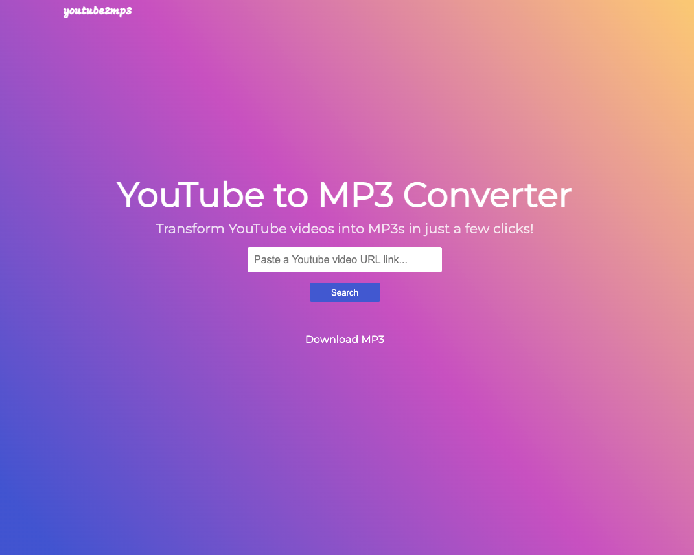

This project was bootstrapped with [vite](https://vitejs.dev/guide/#scaffolding-your-first-vite-project).

<ins>App Preview</ins>

## Available Scripts

In the project directory, you can run:

### `npm install`

Instal All dependencies in this project

### `npm run dev`

Runs the app in the development mode. 
Open [http://127.0.0.1:5173](http://127.0.0.1:5173) to view it in the browser.

### Link

- rapidApi - https://rapidapi.com/ytjar/api/youtube-mp36/
- vite - https://vitejs.dev/guide/#scaffolding-your-first-vite-project
- google font - https://fonts.google.com/
- css gradient - https://cssgradient.io/gradient-backgrounds/
- create env variable in vite - https://vitejs.dev/guide/env-and-mode.html
- function for get id from youtube url - https://stackoverflow.com/questions/3452546/how-do-i-get-the-youtube-video-id-from-a-url

### Video Tutorial

You can see my youtube video for this project in [here](https://youtu.be/TFX19GQ8LMQ)
